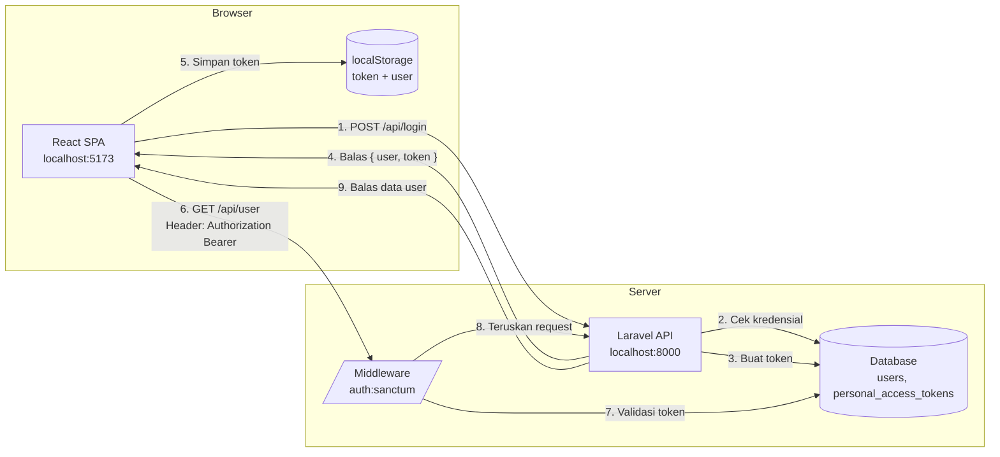
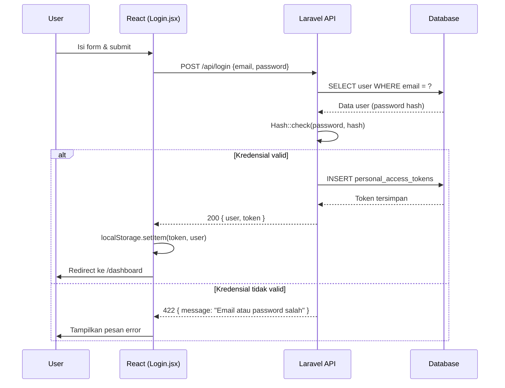
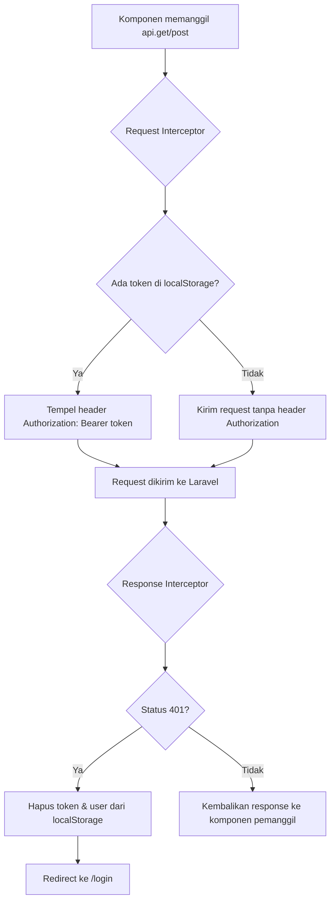
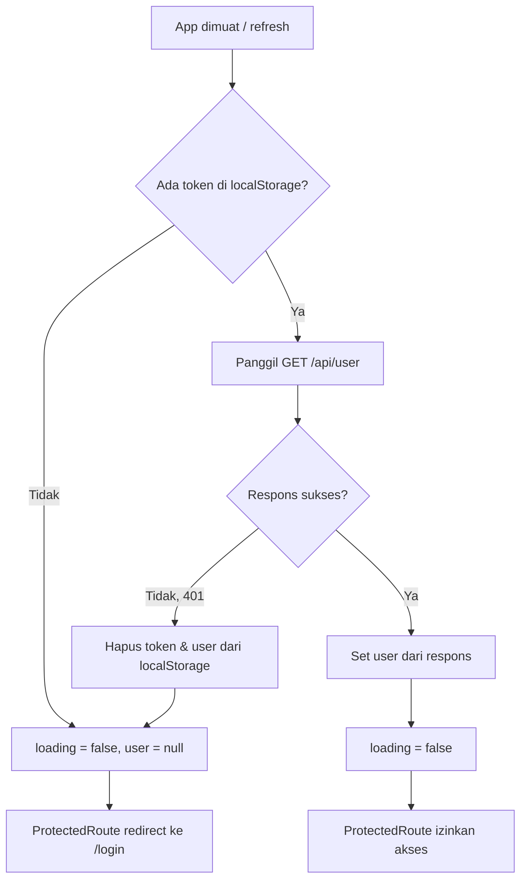
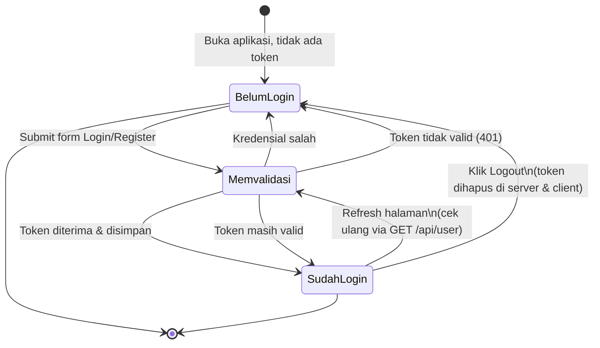

# Tutorial: Autentikasi React dengan Personal Access Token dari Laravel API

Tutorial ini membahas cara membangun autentikasi sederhana antara **React** (SPA terpisah, bukan Inertia) dan **Laravel API** menggunakan **personal access token** dari Laravel Sanctum. Cocok untuk skenario dimana frontend dan backend benar-benar terpisah (misalnya React di-deploy sendiri, memanggil API Laravel lewat HTTP).

> Bagian Laravel pada tutorial ini sudah disesuaikan dengan [dokumentasi resmi Laravel 13.x](https://laravel.com/docs/13.x/sanctum) — termasuk perubahan penting bahwa instalasi Sanctum sekarang cukup lewat satu command `php artisan install:api`, bukan lagi `composer require` + `vendor:publish` manual seperti versi Laravel yang lebih lama.

> **Catatan tentang diagram:** diagram di bawah ditulis dengan sintaks Mermaid. Kalau tidak tampil sebagai gambar di viewer yang kamu pakai, buka file ini di editor yang mendukung Mermaid (VS Code dengan ekstensi "Markdown Preview Mermaid Support", GitHub, Obsidian, atau situs mermaid.live dengan menempel isi blok kodenya).

---

## 1. Konsep Dasar

Berbeda dengan session-based auth (cookie), pendekatan token bekerja seperti ini:

1. User login lewat endpoint `/api/login` → server membuat **personal access token** via Sanctum (`$user->createToken(...)`)
2. Token (string plaintext) dikirim balik ke React
3. React menyimpan token, lalu menyertakannya di header `Authorization: Bearer <token>` pada setiap request berikutnya
4. Middleware `auth:sanctum` di Laravel memvalidasi token tersebut

Ini berbeda dari Sanctum SPA cookie-auth (yang biasa dipakai kalau frontend dan backend satu domain). Personal token cocok untuk API konsumsi umum / mobile / SPA lintas domain.

### 1.1 Diagram Arsitektur

Secara garis besar, komunikasinya seperti ini — dua aplikasi berdiri sendiri-sendiri, saling terhubung murni lewat HTTP/JSON:



**Penjelasan tiap langkah:**

1. Form login di React mengirim `email` + `password` ke `/api/login`
2. Laravel mencocokkan kredensial dengan tabel `users`
3. Jika valid, Sanctum membuat baris baru di tabel `personal_access_tokens` dan menghasilkan string token plaintext (token asli hanya muncul sekali di respons ini — di database yang tersimpan adalah versi hash-nya)
4. Laravel mengembalikan data user + token dalam satu respons JSON
5. React menyimpan token (dan data user) di `localStorage` agar tidak hilang saat halaman di-refresh
6. Untuk setiap request ke endpoint yang butuh login, React menyisipkan token itu di header `Authorization: Bearer <token>`
7. Middleware `auth:sanctum` mengambil token dari header, mencari hash-nya di tabel `personal_access_tokens`, lalu mengaitkannya ke user pemilik token
8–9. Jika token valid, request diteruskan ke controller dan Laravel membalas dengan data yang diminta. Jika tidak valid/kedaluwarsa, Laravel membalas `401 Unauthorized`.

---

## 2. Setup Backend Laravel

### 2.1 Install Sanctum via `install:api`

Mulai Laravel 11 (dan berlaku juga di Laravel 13), skeleton project **tidak lagi menyertakan `routes/api.php` secara default**, dan Sanctum juga tidak otomatis ter-install. Sesuai [dokumentasi resmi Sanctum](https://laravel.com/docs/13.x/sanctum#installation), cara instalasinya sudah disederhanakan menjadi satu Artisan command:

```bash
php artisan install:api
```

Command ini otomatis melakukan semua hal berikut sekaligus, jadi kamu **tidak perlu lagi** menjalankan `composer require laravel/sanctum` atau `vendor:publish` secara manual:

- Meng-install package `laravel/sanctum` lewat Composer
- Membuat file `routes/api.php` (kalau belum ada) dan mendaftarkannya lewat `withRouting()` di `bootstrap/app.php`
- Mem-publish file konfigurasi `config/sanctum.php`
- Mem-publish migration untuk tabel `personal_access_tokens`
- Menawarkan untuk langsung menjalankan migration (kamu bisa jawab `yes`, atau jalankan manual: `php artisan migrate`)

> Kalau project kamu sudah punya `routes/api.php` sebelumnya dan ingin menimpanya, tambahkan flag `--force`. Ada juga flag `--passport` kalau suatu saat kamu ingin pakai Laravel Passport alih-alih Sanctum — tapi untuk personal access token sederhana seperti tutorial ini, Sanctum sudah cukup dan memang direkomendasikan dokumentasi resmi.

Setelah command ini selesai, pastikan model `User` menggunakan trait `HasApiTokens` (di project baru trait ini biasanya sudah otomatis ditambahkan, tapi cek ulang untuk memastikan):

```php
// app/Models/User.php
use Laravel\Sanctum\HasApiTokens;

class User extends Authenticatable
{
    use HasApiTokens, HasFactory, Notifiable;
}
```

### 2.2 Route API

`install:api` sudah membuat `routes/api.php` berisi contoh route `/user` yang dilindungi `auth:sanctum`. Tambahkan route `register`, `login`, `logout` di file yang sama:

```php
// routes/api.php
use App\Http\Controllers\Api\AuthController;

Route::post('/register', [AuthController::class, 'register']);
Route::post('/login', [AuthController::class, 'login']);

Route::middleware('auth:sanctum')->group(function () {
    Route::post('/logout', [AuthController::class, 'logout']);
    Route::get('/user', [AuthController::class, 'user']);
});
```

### 2.3 AuthController

```php
// app/Http/Controllers/Api/AuthController.php
namespace App\Http\Controllers\Api;

use App\Http\Controllers\Controller;
use App\Models\User;
use Illuminate\Http\Request;
use Illuminate\Support\Facades\Hash;
use Illuminate\Validation\ValidationException;

class AuthController extends Controller
{
    public function register(Request $request)
    {
        $validated = $request->validate([
            'name' => 'required|string|max:255',
            'email' => 'required|email|unique:users,email',
            'password' => 'required|min:8|confirmed',
        ]);

        $user = User::create([
            'name' => $validated['name'],
            'email' => $validated['email'],
            'password' => Hash::make($validated['password']),
        ]);

        $token = $user->createToken('auth_token')->plainTextToken;

        return response()->json([
            'success' => true,
            'message' => 'Registrasi berhasil',
            'data' => [
                'user' => $user,
                'token' => $token,
            ],
        ], 201);
    }

    public function login(Request $request)
    {
        $validated = $request->validate([
            'email' => 'required|email',
            'password' => 'required',
        ]);

        $user = User::where('email', $validated['email'])->first();

        if (!$user || !Hash::check($validated['password'], $user->password)) {
            throw ValidationException::withMessages([
                'email' => ['Email atau password salah.'],
            ]);
        }

        $token = $user->createToken('auth_token')->plainTextToken;

        return response()->json([
            'success' => true,
            'message' => 'Login berhasil',
            'data' => [
                'user' => $user,
                'token' => $token,
            ],
        ]);
    }

    public function logout(Request $request)
    {
        $request->user()->currentAccessToken()->delete();

        return response()->json([
            'success' => true,
            'message' => 'Logout berhasil',
        ]);
    }

    public function user(Request $request)
    {
        return response()->json([
            'success' => true,
            'data' => $request->user(),
        ]);
    }
}
```

> Catatan: ini konsisten dengan format response `{ success, message, data }` yang biasa kamu pakai di project keuangan sekolah.

### 2.4 Penjelasan Detail Setiap Method

**`register()`**
- `$request->validate()` memvalidasi input; kalau gagal, Laravel otomatis melempar `ValidationException` dan membalas `422` — kamu tidak perlu menangani ini manual selama sudah ada exception handler standar (seperti di `bootstrap/app.php` project kamu).
- `Hash::make()` meng-hash password sebelum disimpan — **jangan pernah** menyimpan password plaintext.
- `$user->createToken('auth_token')` membuat satu baris baru di tabel `personal_access_tokens`. Nama `'auth_token'` hanya label (berguna kalau nanti user punya banyak token, misalnya satu token per device).
- `->plainTextToken` adalah **satu-satunya kesempatan** kamu melihat token asli dalam bentuk utuh — setelah ini, yang tersimpan di database hanya versi hash SHA-256-nya.

**`login()`**
- Sengaja tidak membedakan pesan error "email tidak ditemukan" vs "password salah" (keduanya digabung jadi "Email atau password salah") — ini praktik keamanan standar supaya penyerang tidak bisa menebak email mana yang terdaftar.
- Setiap kali login berhasil, token **baru** dibuat. Artinya user bisa login dari beberapa device/browser sekaligus, masing-masing punya token sendiri.

**`logout()`**
- `$request->user()` didapat dari token yang divalidasi middleware `auth:sanctum` — Laravel otomatis tahu "siapa yang sedang request" dari token itu.
- `currentAccessToken()->delete()` hanya menghapus token yang **sedang dipakai** di request ini, bukan semua token user. Kalau ingin logout dari semua device sekaligus, gunakan `$request->user()->tokens()->delete()`.

**`user()`**
- Endpoint ringan untuk "siapa saya saat ini" — dipanggil React setiap kali aplikasi dibuka ulang untuk memastikan token di `localStorage` masih valid.

### 2.5 Sequence Diagram: Register & Login



Alur `register()` hampir sama, hanya langkah pertama berubah menjadi `INSERT users` sebelum token dibuat.

### 2.6 CORS

Perlu dicatat, sesuai [dokumentasi routing Laravel 13.x](https://laravel.com/docs/13.x/routing#cors), file `config/cors.php` **tidak lagi dipublish secara default** di project baru — middleware `HandleCors` sudah otomatis ada di global middleware stack dengan konfigurasi bawaan, dan biasanya sudah cukup permisif untuk request OPTIONS. Kalau kamu perlu menyesuaikan origin yang diizinkan (seperti kasus kita, karena React jalan di port berbeda), publish dulu file konfigurasinya:

```bash
php artisan config:publish cors
```

Command ini akan menaruh file `cors.php` di folder `config/`. Baru setelah itu, sesuaikan origin-nya:

```php
// config/cors.php
'paths' => ['api/*'],
'allowed_origins' => ['http://localhost:5173'],
'allowed_methods' => ['*'],
'allowed_headers' => ['*'],
```

Untuk pendekatan personal access token (bukan cookie/session SPA auth), kamu **tidak perlu** mengaktifkan `supports_credentials => true` maupun mendaftarkan domain `stateful` di `config/sanctum.php` — dua opsi itu hanya relevan untuk skema [SPA Authentication berbasis cookie](https://laravel.com/docs/13.x/sanctum#spa-authentication) yang memang tidak kita pakai di tutorial ini, karena tidak ada cookie session yang dikirim sama sekali.

---

## 3. Setup Frontend React

### 3.1 Buat project & install dependency

```bash
npm create vite@latest auth-app -- --template react
cd auth-app
npm install axios react-router-dom
```

### 3.2 Struktur folder

```
src/
├── api/
│   └── axios.js
├── context/
│   └── AuthContext.jsx
├── pages/
│   ├── Login.jsx
│   ├── Register.jsx
│   └── Dashboard.jsx
├── components/
│   └── ProtectedRoute.jsx
├── App.jsx
└── main.jsx
```

### 3.3 Axios instance dengan interceptor token

```javascript
// src/api/axios.js
import axios from 'axios';

const api = axios.create({
  baseURL: 'http://localhost:8000/api',
  headers: {
    Accept: 'application/json',
  },
});

// Sisipkan token dari localStorage di setiap request
api.interceptors.request.use((config) => {
  const token = localStorage.getItem('token');
  if (token) {
    config.headers.Authorization = `Bearer ${token}`;
  }
  return config;
});

// Kalau token invalid/expired, redirect ke login
api.interceptors.response.use(
  (response) => response,
  (error) => {
    if (error.response?.status === 401) {
      localStorage.removeItem('token');
      localStorage.removeItem('user');
      window.location.href = '/login';
    }
    return Promise.reject(error);
  }
);

export default api;
```

**Penjelasan:**
- **Request interceptor** berjalan tepat sebelum setiap request dikirim. Ia membaca token dari `localStorage` dan menempelkannya ke header — jadi kamu **tidak perlu** menulis header ini manual di setiap pemanggilan API.
- **Response interceptor** berjalan setiap kali respons diterima. Kalau server membalas `401` (token tidak valid/kedaluwarsa), interceptor otomatis membersihkan `localStorage` dan mengarahkan user kembali ke halaman login — tanpa perlu menambahkan pengecekan ini di setiap komponen satu per satu.

Diagram alurnya:



### 3.4 AuthContext

```jsx
// src/context/AuthContext.jsx
import { createContext, useContext, useState, useEffect } from 'react';
import api from '../api/axios';

const AuthContext = createContext(null);

export function AuthProvider({ children }) {
  const [user, setUser] = useState(() => {
    const stored = localStorage.getItem('user');
    return stored ? JSON.parse(stored) : null;
  });
  const [loading, setLoading] = useState(true);

  useEffect(() => {
    const token = localStorage.getItem('token');
    if (!token) {
      setLoading(false);
      return;
    }

    // Validasi token masih hidup dengan memanggil /user
    api
      .get('/user')
      .then((res) => {
        setUser(res.data.data);
        localStorage.setItem('user', JSON.stringify(res.data.data));
      })
      .catch(() => {
        localStorage.removeItem('token');
        localStorage.removeItem('user');
        setUser(null);
      })
      .finally(() => setLoading(false));
  }, []);

  const login = async (email, password) => {
    const res = await api.post('/login', { email, password });
    const { user, token } = res.data.data;

    localStorage.setItem('token', token);
    localStorage.setItem('user', JSON.stringify(user));
    setUser(user);
  };

  const register = async (name, email, password, password_confirmation) => {
    const res = await api.post('/register', {
      name,
      email,
      password,
      password_confirmation,
    });
    const { user, token } = res.data.data;

    localStorage.setItem('token', token);
    localStorage.setItem('user', JSON.stringify(user));
    setUser(user);
  };

  const logout = async () => {
    try {
      await api.post('/logout');
    } finally {
      localStorage.removeItem('token');
      localStorage.removeItem('user');
      setUser(null);
    }
  };

  return (
    <AuthContext.Provider value={{ user, loading, login, register, logout }}>
      {children}
    </AuthContext.Provider>
  );
}

export function useAuth() {
  return useContext(AuthContext);
}
```

**Penjelasan bagian per bagian:**

- **State awal (`useState`)**: `user` diinisialisasi langsung dari `localStorage` (bukan `null`) supaya saat halaman di-refresh, UI tidak "berkedip" balik ke tampilan belum-login sebelum data user siap.
- **`loading`**: penting untuk membedakan dua kondisi yang terlihat mirip — "belum login" vs "sedang mengecek apakah token masih valid". Tanpa ini, `ProtectedRoute` bisa salah redirect ke `/login` padahal user sebenarnya masih punya token valid, hanya saja pengecekannya belum selesai.
- **`useEffect` saat mount**: setiap kali aplikasi pertama kali dimuat (misal setelah refresh), token dari `localStorage` divalidasi ulang lewat `GET /api/user`. Ini penting karena token bisa saja sudah dihapus di server (misal user logout dari device lain yang menghapus semua token, atau admin mencabut akses), meskipun masih tersimpan di `localStorage` browser ini.
- **`login` / `register` / `logout`**: ketiganya melakukan hal yang sama — memanggil API, lalu menyinkronkan `localStorage` dengan `state` React (`setUser`). Konsistensi ini yang membuat seluruh aplikasi (lewat `useAuth()`) selalu tahu status login terkini.

Alur saat aplikasi pertama kali dibuka (mount):



### 3.5 ProtectedRoute

```jsx
// src/components/ProtectedRoute.jsx
import { Navigate } from 'react-router-dom';
import { useAuth } from '../context/AuthContext';

export default function ProtectedRoute({ children }) {
  const { user, loading } = useAuth();

  if (loading) return <p>Memuat...</p>;
  if (!user) return <Navigate to="/login" replace />;

  return children;
}
```

**Penjelasan:**
- Komponen ini adalah "wrapper" — dia tidak menampilkan UI sendiri, hanya memutuskan apakah `children` (halaman yang mau dilindungi) boleh dirender atau tidak.
- Urutan pengecekan penting: cek `loading` **dulu**, baru cek `user`. Kalau urutannya dibalik, ada risiko user yang sebenarnya valid sempat ter-redirect ke `/login` selama proses validasi token di `AuthContext` masih berjalan.
- Dipakai dengan membungkus route yang butuh login, seperti terlihat di `App.jsx` pada bagian `/dashboard`.

### 3.6 Halaman Login

```jsx
// src/pages/Login.jsx
import { useState } from 'react';
import { useNavigate, Link } from 'react-router-dom';
import { useAuth } from '../context/AuthContext';

export default function Login() {
  const [email, setEmail] = useState('');
  const [password, setPassword] = useState('');
  const [error, setError] = useState('');
  const { login } = useAuth();
  const navigate = useNavigate();

  const handleSubmit = async (e) => {
    e.preventDefault();
    setError('');
    try {
      await login(email, password);
      navigate('/dashboard');
    } catch (err) {
      setError(err.response?.data?.message ?? 'Login gagal');
    }
  };

  return (
    <form onSubmit={handleSubmit}>
      <h2>Login</h2>
      {error && <p style={{ color: 'red' }}>{error}</p>}
      <input
        type="email"
        placeholder="Email"
        value={email}
        onChange={(e) => setEmail(e.target.value)}
        required
      />
      <input
        type="password"
        placeholder="Password"
        value={password}
        onChange={(e) => setPassword(e.target.value)}
        required
      />
      <button type="submit">Masuk</button>
      <p>
        Belum punya akun? <Link to="/register">Daftar</Link>
      </p>
    </form>
  );
}
```

### 3.7 App.jsx (routing)

```jsx
// src/App.jsx
import { BrowserRouter, Routes, Route } from 'react-router-dom';
import { AuthProvider } from './context/AuthContext';
import ProtectedRoute from './components/ProtectedRoute';
import Login from './pages/Login';
import Register from './pages/Register';
import Dashboard from './pages/Dashboard';

export default function App() {
  return (
    <BrowserRouter>
      <AuthProvider>
        <Routes>
          <Route path="/login" element={<Login />} />
          <Route path="/register" element={<Register />} />
          <Route
            path="/dashboard"
            element={
              <ProtectedRoute>
                <Dashboard />
              </ProtectedRoute>
            }
          />
        </Routes>
      </AuthProvider>
    </BrowserRouter>
  );
}
```

Halaman `Register.jsx` strukturnya sama persis dengan `Login.jsx`, tinggal tambah field `name` dan `password_confirmation`, lalu panggil `register(...)` dari `useAuth()`.

Contoh sederhana `Dashboard.jsx`:

```jsx
// src/pages/Dashboard.jsx
import { useAuth } from '../context/AuthContext';

export default function Dashboard() {
  const { user, logout } = useAuth();

  return (
    <div>
      <h2>Selamat datang, {user?.name}</h2>
      <button onClick={logout}>Logout</button>
    </div>
  );
}
```

---

## 4. Alur Testing

1. Jalankan backend: `php artisan serve` (default `http://localhost:8000`)
2. Jalankan frontend: `npm run dev` (default `http://localhost:5173`)
3. Buka `/register` → isi form → otomatis dapat token → redirect manual ke `/dashboard`
4. Refresh halaman `/dashboard` → `AuthContext` akan memanggil `/api/user` pakai token dari `localStorage` untuk validasi ulang
5. Klik logout → token dihapus di server (`currentAccessToken()->delete()`) dan di client

### 4.1 Diagram Alur Keseluruhan (End-to-End)

Diagram berikut merangkum seluruh siklus hidup satu sesi login, dari awal buka aplikasi sampai logout:



Tiga kondisi utama yang perlu diuji secara manual:

| Skenario | Cara menguji | Hasil yang diharapkan |
|---|---|---|
| Login sukses | Isi email/password benar | Redirect ke `/dashboard`, nama user muncul |
| Login gagal | Isi password salah | Pesan error tampil, tetap di halaman login |
| Akses tanpa login | Buka `/dashboard` langsung di tab baru (tanpa login) | Redirect otomatis ke `/login` |
| Token dihapus manual | Login, lalu hapus token lewat DevTools (`localStorage.removeItem('token')`), lalu refresh | Redirect ke `/login` |
| Token dicabut di server | Login, hapus baris token di tabel `personal_access_tokens` lewat DB, lalu refresh halaman | `GET /api/user` balas 401 → redirect ke `/login` |

---

## 5. Poin Penting & Potensi Pengembangan

- **Keamanan localStorage**: token di `localStorage` rentan terhadap XSS. Untuk aplikasi produksi yang lebih sensitif (mis. aplikasi keuangan), pertimbangkan `httpOnly` cookie + [Sanctum SPA stateful auth](https://laravel.com/docs/13.x/sanctum#spa-authentication), bukan personal token di localStorage.
- **Token expiration**: menurut [dokumentasi Sanctum](https://laravel.com/docs/13.x/sanctum#token-expiration), token secara default **tidak pernah expire** dan hanya bisa dinonaktifkan lewat revoke manual. Kalau ingin semua token expire otomatis, atur di `config/sanctum.php`:
  ```php
  'expiration' => 525600, // dalam menit, contoh: 1 tahun
  ```
  Atau tentukan masa berlaku per-token saat dibuat (argumen ketiga `createToken`):
  ```php
  $user->createToken('auth_token', ['*'], now()->addWeek())->plainTextToken;
  ```
  Kalau memakai fitur expiration, jadwalkan juga pembersihan token yang sudah kedaluwarsa lewat command bawaan Sanctum, misalnya di `routes/console.php`:
  ```php
  use Illuminate\Support\Facades\Schedule;

  Schedule::command('sanctum:prune-expired --hours=24')->daily();
  ```
- **Revoke token**: selain `currentAccessToken()->delete()` (logout device saat ini) dan `$user->tokens()->delete()` (logout semua device), kamu juga bisa mencabut token tertentu berdasarkan ID: `$user->tokens()->where('id', $tokenId)->delete()` — berguna untuk fitur "kelola device yang login" di halaman akun.
- **Token abilities**: Sanctum juga mendukung "abilities" (mirip scope OAuth) lewat argumen kedua `createToken('nama', ['posts:create'])`, lalu dicek dengan `$user->tokenCan('posts:create')`. Berguna kalau nanti butuh token dengan hak akses terbatas (misal token khusus untuk integrasi pihak ketiga).
- **Refresh token**: personal access token tidak punya mekanisme refresh bawaan seperti JWT. Kalau butuh itu, biasanya solusinya re-login atau pakai package tambahan.
- **Reuse untuk project keuangan sekolah**: pola `AuthContext` + axios interceptor ini bisa langsung dipakai kalau nanti frontend React project keuangan sekolah dipisah dari Inertia (murni SPA + API).

Silakan disesuaikan nama field, validasi, dan struktur folder dengan kebutuhan project kamu.

---

## 6. Referensi Resmi

- [Laravel 13.x — Sanctum](https://laravel.com/docs/13.x/sanctum) — instalasi, issuing token, abilities, revoke, expiration
- [Laravel 13.x — Authentication](https://laravel.com/docs/13.x/authentication) — konteks kapan pakai Sanctum vs Passport vs auth cookie bawaan
- [Laravel 13.x — Routing (bagian CORS & API routes)](https://laravel.com/docs/13.x/routing) — `install:api`, `config:publish cors`
