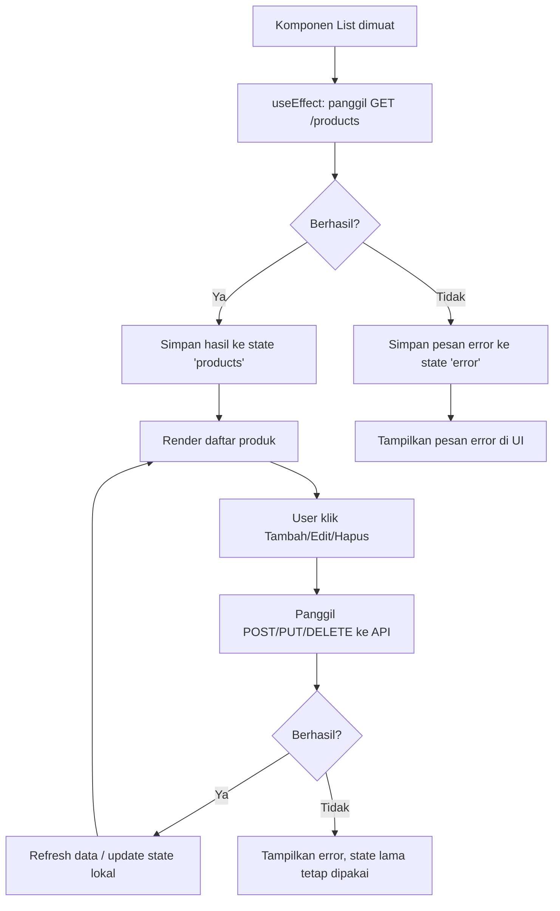
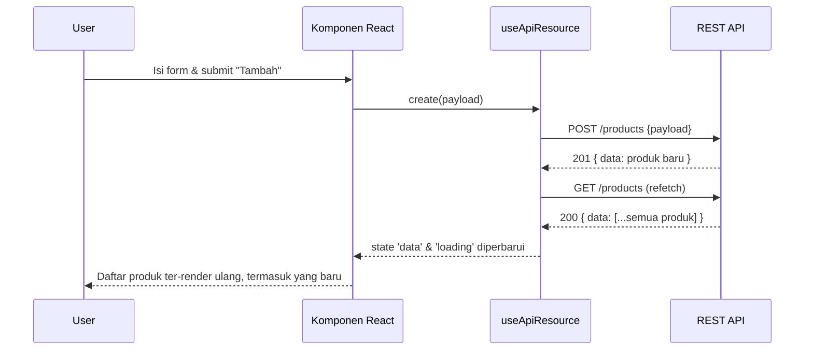
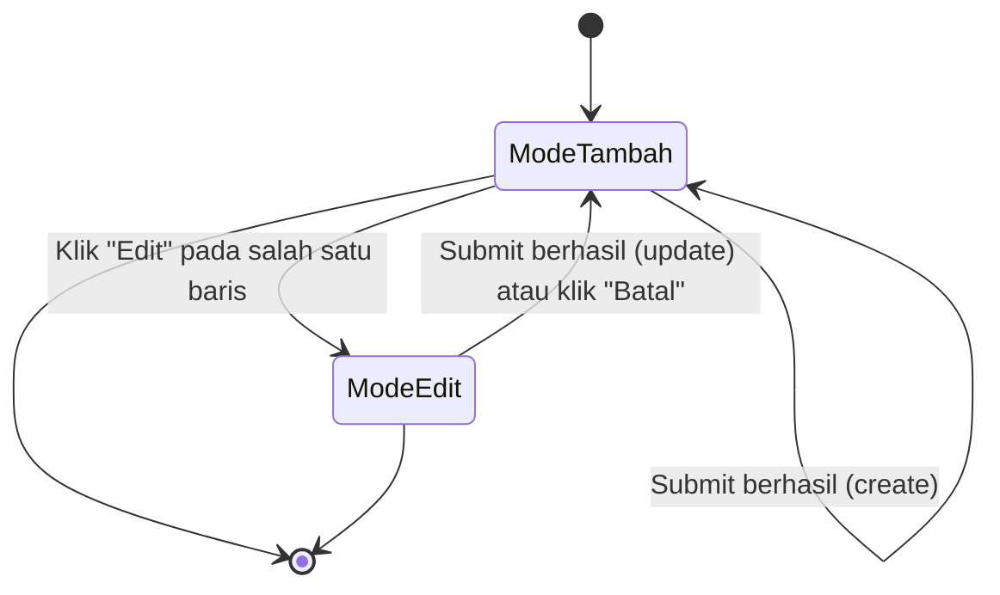

# Tutorial: Mengelola Data (CRUD) dari REST API dengan React

Tutorial ini membahas cara React mengambil, menampilkan, menambah, mengubah, dan menghapus data dari REST API — pola **CRUD** (Create, Read, Update, Delete) yang paling umum dipakai di aplikasi nyata (misalnya daftar produk, daftar transaksi, daftar siswa, dsb).

> **Catatan:** tutorial ini melanjutkan setup axios (`src/api/axios.js`) dari tutorial sebelumnya ("Autentikasi React dengan Personal Access Token dari Laravel API"). Kalau kamu belum punya file itu, cukup buat instance axios biasa tanpa interceptor token — semua konsep CRUD di bawah tetap berlaku sama.

> **Catatan diagram:** semua diagram di bawah pakai sintaks Mermaid. Buka file ini di editor yang mendukung Mermaid (VS Code + ekstensi "Markdown Preview Mermaid Support", GitHub, Obsidian, atau tempel ke mermaid.live) untuk melihatnya sebagai gambar.

---

## 1. Konsep Dasar

CRUD di REST API biasanya dipetakan ke method HTTP seperti ini:

| Operasi | Method HTTP | Contoh Endpoint | Fungsi |
|---|---|---|---|
| Create | `POST` | `/api/products` | Menambah data baru |
| Read (list) | `GET` | `/api/products` | Mengambil semua data |
| Read (detail) | `GET` | `/api/products/{id}` | Mengambil satu data |
| Update | `PUT` / `PATCH` | `/api/products/{id}` | Mengubah data |
| Delete | `DELETE` | `/api/products/{id}` | Menghapus data |

Di React, pola umumnya:

1. Simpan data dari API di **state** (`useState`)
2. Ambil data lewat `useEffect` saat komponen pertama kali dimuat
3. Setiap aksi (tambah/ubah/hapus) memanggil API, lalu **menyinkronkan ulang state** supaya UI selalu mencerminkan data terbaru
4. Tangani tiga kondisi wajib: **loading**, **error**, dan **data kosong** — bukan cuma "data berhasil tampil"

### 1.1 Diagram Alur Umum



---

## 2. Ringkasan Struktur Folder

```
src/
├── api/
│   └── axios.js
├── hooks/
│   └── useApiResource.js
├── components/
│   ├── ProductList.jsx
│   └── ProductForm.jsx
└── pages/
    └── ProductsPage.jsx
```

---

## 3. Setup Axios Instance

Kalau belum ada, buat instance axios yang bisa dipakai ulang di seluruh aplikasi:

```javascript
// src/api/axios.js
import axios from 'axios';

const api = axios.create({
  baseURL: 'http://localhost:8000/api',
  headers: {
    Accept: 'application/json',
  },
});

export default api;
```

> Kalau API kamu butuh autentikasi (Bearer token), tambahkan request interceptor seperti di tutorial autentikasi sebelumnya. Bagian CRUD di tutorial ini tidak bergantung pada itu — instance axios biasa sudah cukup untuk fokus belajar pola CRUD-nya.

---

## 4. Custom Hook: `useApiResource`

Daripada menulis logika fetch berulang-ulang di setiap komponen, kita bungkus jadi satu custom hook yang menangani state `data`, `loading`, `error`, sekaligus fungsi `create`, `update`, `remove`.

```javascript
// src/hooks/useApiResource.js
import { useState, useEffect, useCallback } from 'react';
import api from '../api/axios';

export function useApiResource(endpoint) {
  const [data, setData] = useState([]);
  const [loading, setLoading] = useState(true);
  const [error, setError] = useState(null);

  const fetchData = useCallback(async () => {
    setLoading(true);
    setError(null);
    try {
      const res = await api.get(endpoint);
      setData(res.data.data ?? res.data);
    } catch (err) {
      setError(err.response?.data?.message ?? 'Gagal memuat data');
    } finally {
      setLoading(false);
    }
  }, [endpoint]);

  useEffect(() => {
    fetchData();
  }, [fetchData]);

  const create = async (payload) => {
    const res = await api.post(endpoint, payload);
    await fetchData(); // refresh list setelah tambah data
    return res.data;
  };

  const update = async (id, payload) => {
    const res = await api.put(`${endpoint}/${id}`, payload);
    await fetchData(); // refresh list setelah ubah data
    return res.data;
  };

  const remove = async (id) => {
    await api.delete(`${endpoint}/${id}`);
    setData((prev) => prev.filter((item) => item.id !== id)); // langsung update state, tanpa refetch
  };

  return { data, loading, error, refetch: fetchData, create, update, remove };
}
```

### 4.1 Penjelasan Detail

- **`useCallback` pada `fetchData`**: supaya fungsi ini tidak dibuat ulang setiap render, dan aman dipakai sebagai dependency `useEffect` tanpa memicu infinite loop.
- **`res.data.data ?? res.data`**: banyak REST API (termasuk Laravel dengan API Resource atau paginasi) membungkus data asli di dalam properti `data`. Baris ini menangani dua kemungkinan bentuk respons sekaligus.
- **`create` dan `update` memanggil `fetchData()` ulang**: pendekatan paling sederhana dan paling "aman" — sumber kebenaran data selalu dari server, bukan asumsi di client. Trade-off-nya ada request tambahan setiap kali create/update.
- **`remove` langsung memfilter state lokal** tanpa refetch: ini contoh **optimistic update** sederhana — karena kita sudah tahu persis item mana yang hilang (berdasarkan `id`), tidak perlu request ulang ke server untuk konfirmasi. Lebih cepat terasa di UI.
- Hook ini **generik** — tinggal panggil `useApiResource('/products')` atau `useApiResource('/students')`, tidak perlu menulis ulang logika fetch/create/update/delete untuk tiap jenis data.

### 4.2 Sequence Diagram: Create & Refresh



---

## 5. Komponen List: Menampilkan Data (Read)

```jsx
// src/components/ProductList.jsx
import { useApiResource } from '../hooks/useApiResource';

export default function ProductList() {
  const { data: products, loading, error, remove } = useApiResource('/products');

  if (loading) return <p>Memuat data...</p>;
  if (error) return <p style={{ color: 'red' }}>{error}</p>;
  if (products.length === 0) return <p>Belum ada produk.</p>;

  return (
    <table>
      <thead>
        <tr>
          <th>Nama</th>
          <th>Harga</th>
          <th>Aksi</th>
        </tr>
      </thead>
      <tbody>
        {products.map((product) => (
          <tr key={product.id}>
            <td>{product.name}</td>
            <td>{product.price}</td>
            <td>
              <button onClick={() => remove(product.id)}>Hapus</button>
            </td>
          </tr>
        ))}
      </tbody>
    </table>
  );
}
```

**Penjelasan:**
- Tiga kondisi (`loading`, `error`, `products.length === 0`) dicek **sebelum** merender tabel — ini mencegah tampilan "tabel kosong yang membingungkan" saat data sebenarnya masih dimuat atau gagal diambil.
- `key={product.id}` wajib ada di setiap elemen hasil `.map()` — React memakainya untuk melacak elemen mana yang berubah/dihapus tanpa merender ulang seluruh daftar.
- Tombol "Hapus" langsung memanggil `remove(product.id)` dari hook — komponen ini tidak perlu tahu detail bagaimana request DELETE dikirim.

---

## 6. Komponen Form: Tambah & Edit (Create + Update)

Form yang sama dipakai untuk dua mode: tambah data baru dan edit data yang sudah ada.

```jsx
// src/components/ProductForm.jsx
import { useState, useEffect } from 'react';

export default function ProductForm({ initialData, onSubmit, onCancel }) {
  const [name, setName] = useState('');
  const [price, setPrice] = useState('');

  // Kalau initialData diberikan (mode edit), isi form dengan data tersebut
  useEffect(() => {
    if (initialData) {
      setName(initialData.name);
      setPrice(initialData.price);
    }
  }, [initialData]);

  const handleSubmit = (e) => {
    e.preventDefault();
    onSubmit({ name, price: Number(price) });
  };

  return (
    <form onSubmit={handleSubmit}>
      <input
        type="text"
        placeholder="Nama produk"
        value={name}
        onChange={(e) => setName(e.target.value)}
        required
      />
      <input
        type="number"
        placeholder="Harga"
        value={price}
        onChange={(e) => setPrice(e.target.value)}
        required
      />
      <button type="submit">{initialData ? 'Simpan Perubahan' : 'Tambah Produk'}</button>
      {initialData && (
        <button type="button" onClick={onCancel}>
          Batal
        </button>
      )}
    </form>
  );
}
```

**Penjelasan:**
- Komponen ini **tidak tahu** apakah dia sedang dipakai untuk create atau update — itu ditentukan oleh parent lewat prop `initialData` dan `onSubmit`. Pola ini disebut "controlled dari parent", membuat form bisa dipakai ulang di banyak konteks.
- `useEffect` yang mengisi ulang state saat `initialData` berubah penting supaya form otomatis terisi saat user klik "Edit" pada baris tertentu.

---

## 7. Menggabungkan List + Form dalam Satu Halaman

```jsx
// src/pages/ProductsPage.jsx
import { useState } from 'react';
import { useApiResource } from '../hooks/useApiResource';
import ProductForm from '../components/ProductForm';

export default function ProductsPage() {
  const { data: products, loading, error, create, update, remove } = useApiResource('/products');
  const [editingProduct, setEditingProduct] = useState(null);

  const handleSubmit = async (payload) => {
    if (editingProduct) {
      await update(editingProduct.id, payload);
      setEditingProduct(null);
    } else {
      await create(payload);
    }
  };

  return (
    <div>
      <h2>Kelola Produk</h2>

      <ProductForm
        initialData={editingProduct}
        onSubmit={handleSubmit}
        onCancel={() => setEditingProduct(null)}
      />

      {loading && <p>Memuat data...</p>}
      {error && <p style={{ color: 'red' }}>{error}</p>}

      <ul>
        {products.map((product) => (
          <li key={product.id}>
            {product.name} — Rp{product.price}
            <button onClick={() => setEditingProduct(product)}>Edit</button>
            <button onClick={() => remove(product.id)}>Hapus</button>
          </li>
        ))}
      </ul>
    </div>
  );
}
```

**Penjelasan:**
- `editingProduct` menyimpan produk mana yang sedang di-edit (`null` berarti mode tambah data baru).
- `handleSubmit` menjadi satu-satunya tempat yang memutuskan apakah harus memanggil `create` atau `update` — komponen `ProductForm` tetap sederhana dan tidak perlu tahu logika ini.
- Setelah update berhasil, `setEditingProduct(null)` mengembalikan form ke mode "tambah data baru".

### 7.1 State Diagram: Mode Form



---

## 8. Menangani Error Lebih Detail

Error dari REST API biasanya punya beberapa bentuk. Pola penanganan yang lebih matang:

```javascript
try {
  await create(payload);
} catch (err) {
  if (err.response?.status === 422) {
    // Error validasi — biasanya berbentuk { errors: { name: ["..."], price: ["..."] } }
    setValidationErrors(err.response.data.errors);
  } else if (err.response?.status === 404) {
    setError('Data tidak ditemukan, mungkin sudah dihapus pengguna lain.');
  } else {
    setError('Terjadi kesalahan, coba lagi.');
  }
}
```

**Penjelasan:**
- Status `422` (Unprocessable Entity) umum dipakai untuk error validasi form — bentuknya biasanya per-field, jadi ditangani terpisah dari pesan error umum supaya bisa ditampilkan tepat di bawah input yang salah.
- Status `404` berguna untuk kasus "data yang mau di-update/hapus ternyata sudah tidak ada" — misalnya dua admin mengelola data yang sama secara bersamaan.
- Selalu sediakan pesan fallback untuk error yang tidak terduga (network error, server down, dll), supaya UI tidak diam tanpa penjelasan.

---

## 9. Loading State per Aksi (Bukan Cuma saat Fetch Awal)

Selain loading saat pertama kali data dimuat, aksi seperti submit/hapus juga sebaiknya punya indikator loading sendiri, supaya tombol tidak bisa diklik berkali-kali saat request masih berjalan:

```jsx
const [submitting, setSubmitting] = useState(false);

const handleSubmit = async (payload) => {
  setSubmitting(true);
  try {
    await create(payload);
  } finally {
    setSubmitting(false);
  }
};

// <button disabled={submitting}>{submitting ? 'Menyimpan...' : 'Simpan'}</button>
```

Ini penting terutama untuk aksi hapus/simpan yang efeknya permanen — mencegah user tidak sengaja mengirim request yang sama dua kali karena double-click.

---


