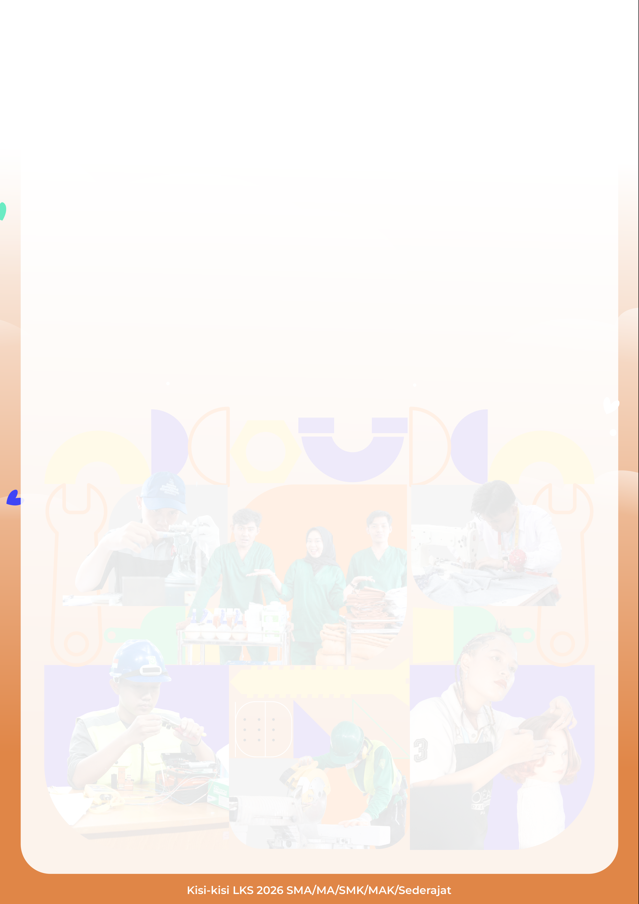
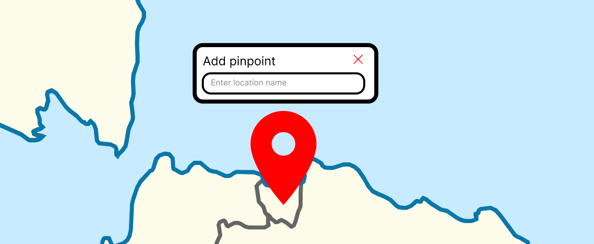
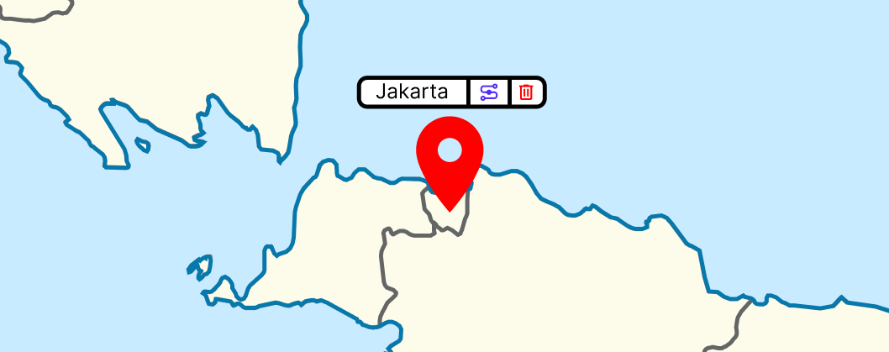
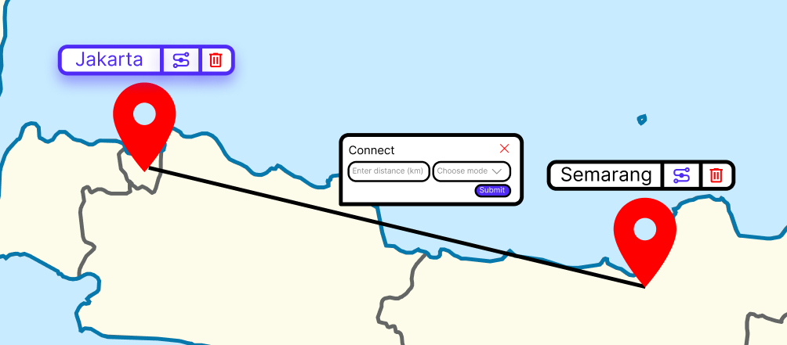
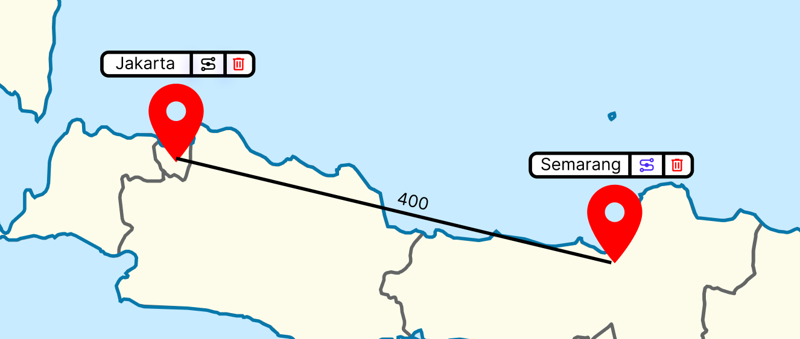
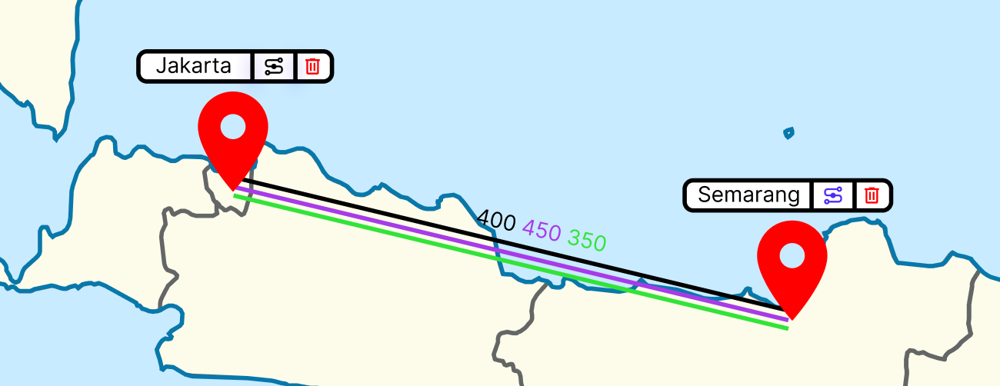
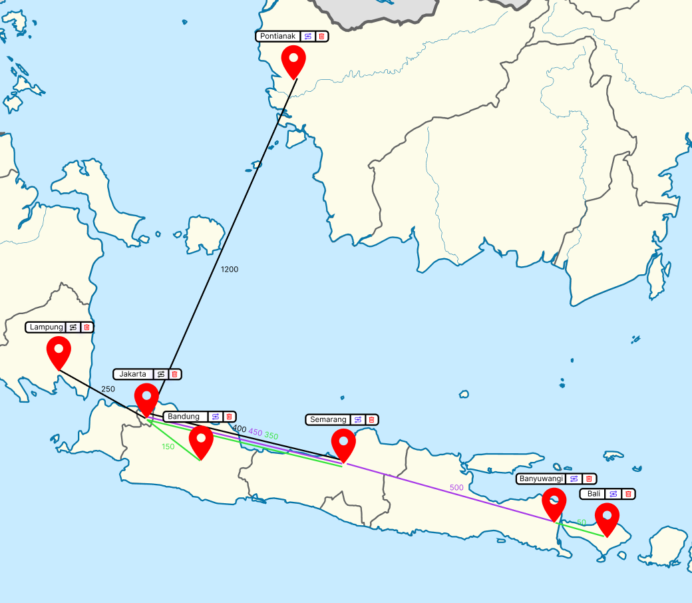
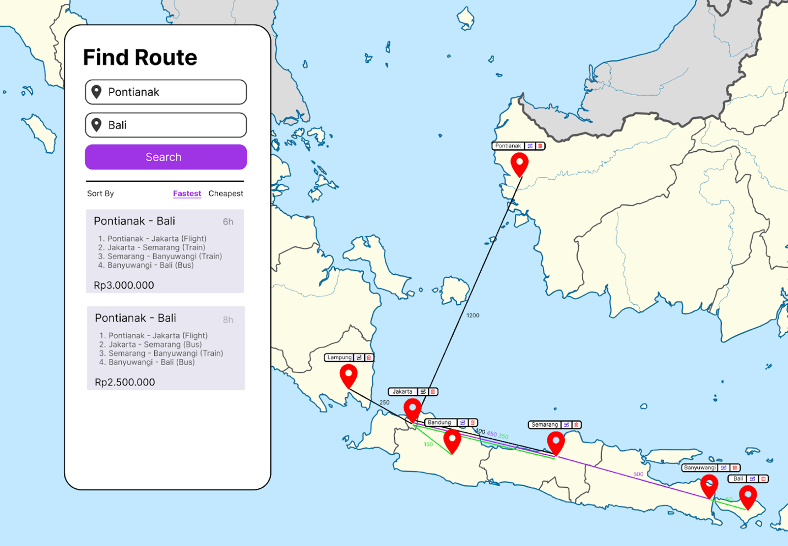
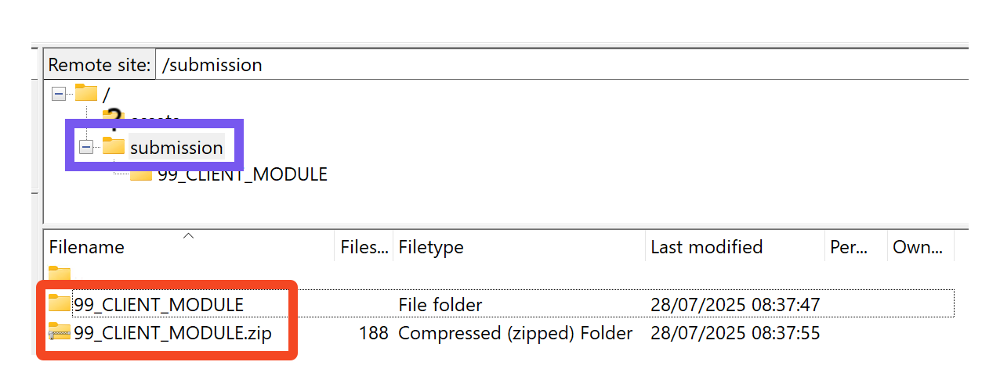

# MODUL SISI KLIEN (CLIENT-SIDE MODULE)

*Dokumen ini merupakan terjemahan bahasa Indonesia dari dokumen kisi-kisi LKS 2026 SMA/MA/SMK/MAK Sederajat — Modul Sisi Klien (WebTech Indonesia), versi asli 1.0 tertanggal 06.02.2026.*

---

## Daftar Isi Berkas

Modul ini terdiri atas berkas-berkas berikut:

1. MODUL SISI KLIEN.docx
2. MODUL SISI KLIEN.pdf
3. MODUL SISI KLIEN MEDIA.zip

---

## Gambaran Umum Proyek

Seorang klien membutuhkan sebuah peta visual yang dapat menampilkan berbagai lokasi beserta rute menuju masing-masing lokasi tersebut. Peta ini harus bersifat interaktif, memungkinkan pengguna untuk melakukan zoom, pan (geser), dan mengeklik penanda (marker) untuk melihat informasi detail. Situs web ini harus kompatibel dengan browser web modern maupun perangkat seluler.

Modul ini merupakan tugas kompetisi berdurasi 3 jam. Peserta diwajibkan mengembangkan aplikasi berbasis web hanya menggunakan HTML, CSS, dan JavaScript. Fungsi inti dari aplikasi ini berkisar pada peta interaktif Indonesia, yang memungkinkan pengguna menambahkan, menghubungkan, dan mengelola lokasi pinpoint, serta mencari rute di antara lokasi-lokasi tersebut. Peserta diperbolehkan meningkatkan aspek usability dan antarmuka pengguna (UI) demi pengalaman pengguna yang lebih baik.

### Memuat Peta (Loading the Map)

Peserta akan diberikan sebuah gambar SVG peta Indonesia. Peta tersebut harus dimuat ke dalam halaman dalam ukuran penuh (full size) dan sudah dalam kondisi zoom-in tanpa menyisakan ruang kosong.

### Menambahkan Lokasi Pinpoint (Adding Pinpoint Location)

Melakukan klik dua kali (double-click) pada peta akan menampilkan sebuah popup yang berisi kolom input untuk nama lokasi guna menambahkan pinpoint pada peta. Mengeklik tombol enter akan mengirimkan (submit) formulir tersebut.

Jika pinpoint berhasil ditambahkan, tampilan harus menunjukkan nama pinpoint, sebuah tombol untuk menghubungkan (connect) pinpoint tersebut, dan sebuah tombol untuk menghapusnya. Sebuah pinpoint harus ditandai dengan ikon map-pin berwarna merah.

Pinpoint yang telah dibuat harus bersifat persisten. Memuat ulang (reload) halaman tidak boleh menghilangkan pinpoint yang sudah ada.

### Menghubungkan Lokasi (Connect Locations)

Jika pengguna mengeklik ikon connect, label pinpoint harus menunjukkan tanda bahwa pinpoint tersebut sedang berada dalam status "menghubungkan" (misalnya dengan efek glow atau perubahan warna). Selanjutnya, pengguna mengeklik pinpoint tujuan, dan popup connect akan muncul.

Pada formulir ini, pengguna perlu memasukkan jarak dalam satuan kilometer beserta moda transportasinya. Moda transportasi terdiri atas:

| Moda Transportasi | Warna Garis | Kecepatan | Biaya |
|---|---|---|---|
| Kereta (Train) | `#33E339` | 120 km/j | Rp500/km |
| Bus | `#A83BE8` | 80 km/j | Rp100/km |
| Pesawat (Airplane) | `#000000` | 800 km/j | Rp1.000/km |

Setelah formulir dikirim (submit), sebuah garis akan muncul yang menghubungkan kedua lokasi pinpoint tersebut, dengan jarak ditampilkan di tengah garis.

Pengguna dapat menambahkan hingga seluruh moda transportasi untuk setiap koneksi. Setiap koneksi dapat memiliki jarak yang berbeda-beda, dan jarak (dalam km) akan ditampilkan di bagian tengah masing-masing garis.

### Pan dan Zoom

Fungsi pan dan zoom harus berjalan dengan benar. Pengguna harus dapat melakukan zoom-in dan zoom-out pada peta dengan cara menekan **CTRL+Scroll** atau **CTRL+(+) dan CTRL+(-)**. Fungsi zoom-in dan zoom-out harus mengikuti posisi kursor.

Pada kondisi peta yang sudah di-zoom, pengguna harus dapat **menggeser peta ke kiri dan ke kanan dengan cara menahan klik lalu menggerakkan kursor**.

### Cari Rute (Find Route)

Modal *Find Route* harus selalu berada di sisi kiri viewport browser. Pengguna harus dapat memasukkan **"from pinpoint"** (dari pinpoint) dan **"to pinpoint"** (ke pinpoint) dengan nama yang sesuai persis (*exact keyword*). Jika salah satu input berisi nama pinpoint yang tidak valid, **tombol pencarian (search) harus dinonaktifkan (disabled)**.

Mengeklik tombol pencarian akan menampilkan **maksimal 10 kemungkinan rute**, diurutkan berdasarkan **durasi tercepat (fastest)** atau **biaya termurah (cheapest)**. Urutan default adalah berdasarkan yang tercepat.

Pada setiap rute, tampilkan **nama rute, tahapan moda transportasi, durasi, dan total biaya**.

### Menghapus Pinpoint dan Koneksi (Removing Pinpoint and Connection)

Untuk menghapus koneksi antar-pinpoint, pengguna harus dapat **mengeklik garis penghubung tersebut lalu menekan tombol del/backspace**. Sebuah pinpoint dapat dihapus dengan mengeklik **tombol tempat sampah (trash can)** pada labelnya, yang juga akan menghapus seluruh koneksi yang terkait dengannya.

---

## Petunjuk untuk Peserta

1. Proyek ini akan dinilai menggunakan browser **Firefox Developer Edition** atau **Google Chrome**.
2. Peserta dapat menyediakan berkas **README** sebagai panduan menjalankan proyek apabila diperlukan.
3. Buat folder induk (*root folder*) bernama **XX_CLIENT_SIDE_MODULE** di komputer lokal, dengan **XX** adalah nomor komputer peserta.
4. Letakkan hasil pekerjaan di dalam folder induk tersebut. Pastikan hasil pekerjaan berjalan dengan baik saat berkas **index.html** dibuka secara langsung.
5. Unggah folder **XX_CLIENT_SIDE_MODULE** ke server FTP di dalam folder **"submission"** (lihat contoh pada gambar).
6. Kompres (zip) folder induk **XX_CLIENT_SIDE_MODULE** dan unggah juga ke server FTP (lihat contoh pada gambar).

---

## Lain-lain

| # | Sub-Kriteria | Nilai |
|---|---|---|
| 1 | Fungsionalitas Peta | 8.5 |
| 2 | Kontrol Pinpoint | 4.5 |
| 3 | Koneksi Pinpoint | 7 |
| 4 | Cari Rute (Find Routes) | 10 |
| | **Total** | **30** |
