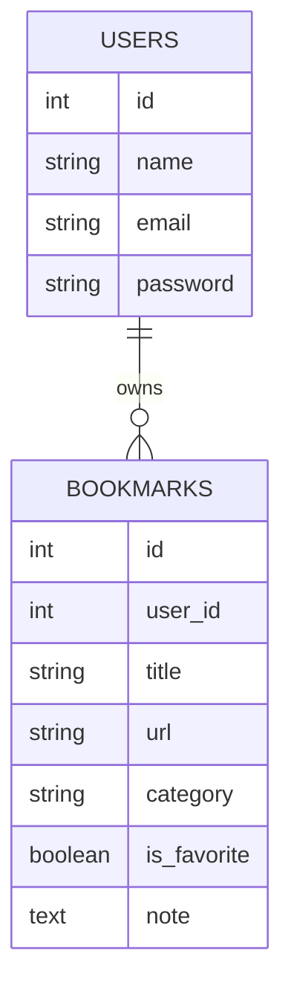
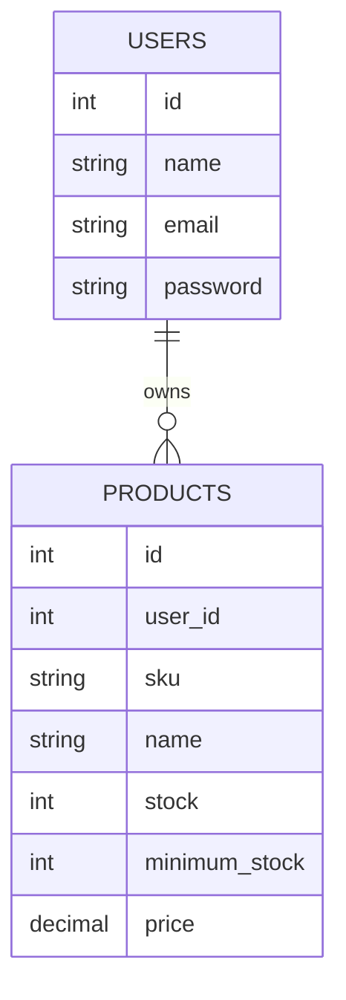
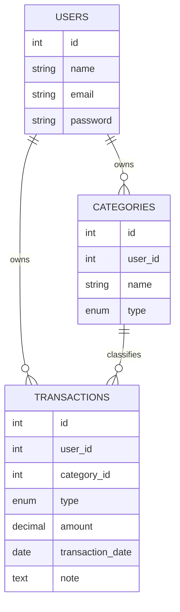

# Rancangan Proyek Sederhana — Latihan Kompetisi
### React + Laravel 13 REST API
### Bookmark Manager • Inventory Manager • Expense Tracker

Versi ini sengaja dipangkas ke fitur inti saja (1 entitas utama, minim relasi), supaya realistis dikerjakan dalam waktu terbatas seperti sesi latihan/kompetisi (target: bisa selesai backend + frontend dasar dalam 3–5 jam per aplikasi).

**Aturan umum yang sama untuk ketiganya:**
- Auth pakai Laravel Sanctum (register, login, logout) — 1 modul, reuse untuk 3 proyek
- Untuk Bookmark Manager & Inventory Manager, tidak ada multi-tabel kategori/tag terpisah — kategori cukup jadi kolom `string` atau `enum`. Expense Tracker jadi pengecualian: kategorinya pakai tabel `categories` tersendiri (lihat bagian 3)
- Tidak ada fitur laporan/export/grafik — cukup list, create, edit, delete, dan 1 angka ringkasan sederhana
- Response API konsisten: `{ "data": ..., "message": "..." }`

---

## 1. Bookmark Manager (Sederhana)

### Fitur Inti
- Register/login
- CRUD bookmark: judul, URL, kategori (string bebas), catatan
- Toggle favorite
- Search berdasarkan judul

### Skema Database


### Endpoint API
```
POST   /api/v1/register
POST   /api/v1/login
POST   /api/v1/logout

GET    /api/v1/bookmarks?search=&category=&is_favorite=
POST   /api/v1/bookmarks
PUT    /api/v1/bookmarks/{id}
DELETE /api/v1/bookmarks/{id}
PATCH  /api/v1/bookmarks/{id}/toggle-favorite
```

**Estimasi:** 3–4 jam (1 tabel relasi ke user, tanpa fitur tambahan)

---

## 2. Inventory Manager (Sederhana)

### Fitur Inti
- Register/login
- CRUD produk: nama, kode/SKU, stok, harga
- Tambah stok (stok in) dan kurangi stok (stok out) langsung update kolom `stock` di tabel produk
- Badge/flag stok menipis (`stock <= minimum_stock`) — cukup dihitung saat response, tanpa tabel notifikasi

### Skema Database


### Endpoint API
```
POST   /api/v1/register
POST   /api/v1/login
POST   /api/v1/logout

GET    /api/v1/products?search=&low_stock=true
POST   /api/v1/products
PUT    /api/v1/products/{id}
DELETE /api/v1/products/{id}
PATCH  /api/v1/products/{id}/stock-in    -- body: { "quantity": n }
PATCH  /api/v1/products/{id}/stock-out   -- body: { "quantity": n }
```

### Catatan Teknis
Cukup 1 tabel (`products`) yang menyimpan stok langsung. Update stok-in/stok-out dilakukan dengan `increment()`/`decrement()` bawaan Eloquent — tidak perlu tabel `stock_movements` terpisah untuk versi latihan ini. Kalau ada waktu lebih dan ingin tantangan tambahan, histori mutasi bisa jadi *fitur bonus* opsional.

**Estimasi:** 4–5 jam (logika stok-in/out perlu validasi stok tidak boleh minus)

---

## 3. Expense Tracker (Sederhana)

### Fitur Inti
- Register/login
- CRUD kategori: nama, jenis (income/expense)
- CRUD transaksi: jumlah, jenis (income/expense), kategori (relasi ke tabel `categories`), tanggal, catatan
- Ringkasan sederhana: total income, total expense, saldo (dihitung on-the-fly, tanpa tabel akun/budget terpisah)

### Skema Database


### Endpoint API
```
POST   /api/v1/register
POST   /api/v1/login
POST   /api/v1/logout

GET    /api/v1/categories?type=
POST   /api/v1/categories
PUT    /api/v1/categories/{id}
DELETE /api/v1/categories/{id}

GET    /api/v1/transactions?type=&category_id=&month=&year=
POST   /api/v1/transactions
PUT    /api/v1/transactions/{id}
DELETE /api/v1/transactions/{id}

GET    /api/v1/summary?month=&year=   -- { total_income, total_expense, balance }
```

### Catatan Teknis
- `categories.type` sebaiknya sama nilainya dengan `transactions.type` (income/expense), supaya saat memilih kategori di form transaksi, dropdown-nya bisa difilter otomatis sesuai jenis transaksi.
- Validasi saat create transaksi: `category_id` yang dipilih harus punya `type` yang sama dengan `type` transaksinya (jangan sampai kategori "Gaji" dipakai untuk transaksi expense).
- Kalau produk dihapus (`DELETE /categories/{id}`) tapi masih dipakai transaksi lama, pertimbangkan pakai *soft delete* daripada hard delete, supaya histori transaksi lama tidak kehilangan kategorinya.

**Estimasi:** 4–5 jam (nambah 1 tabel relasi + validasi kecocokan tipe kategori-transaksi)

---

## 4. Wireframe UI (React)

Wireframe ini fokus ke layout, bukan styling — cukup jadi acuan komponen apa saja yang perlu dibuat di React (misalnya `<Navbar>`, `<BookmarkCard>`, `<TransactionForm>`, dst).

### 4.1 Bookmark Manager

**Halaman Login/Register**
```
┌──────────────────────────────┐
│         Bookmark Manager      │
│                               │
│   Email     [______________] │
│   Password  [______________] │
│                               │
│          [ Login ]           │
│      Belum punya akun? Daftar │
└──────────────────────────────┘
```

**Halaman List Bookmark**
```
┌──────────────────────────────────────────────┐
│ Bookmark Manager      [Search...........] 🔍 │
├──────────────────────────────────────────────┤
│ [Semua] [Favorit] [Kategori ▾]     [+ Tambah] │
├──────────────────────────────────────────────┤
│ ★ Judul Bookmark 1          [kategori: Kerja] │
│   https://example.com          [Edit] [Hapus] │
├────────────────────────────────────────────── │
│ ☆ Judul Bookmark 2          [kategori: Baca]  │
│   https://example.com          [Edit] [Hapus] │
└──────────────────────────────────────────────┘
```

**Modal/Form Tambah/Edit Bookmark**
```
┌──────────────────────────────┐
│ Tambah Bookmark          [x] │
│                               │
│ Judul     [______________]  │
│ URL       [______________]  │
│ Kategori  [______________]  │
│ Catatan   [______________]  │
│ ☐ Tandai favorit             │
│                               │
│         [Batal] [Simpan]     │
└──────────────────────────────┘
```

### 4.2 Inventory Manager

**Halaman List Produk**
```
┌──────────────────────────────────────────────────────┐
│ Inventory Manager     [Search SKU/Nama.....] 🔍       │
├──────────────────────────────────────────────────────┤
│ [☐ Tampilkan stok menipis saja]         [+ Produk]    │
├──────────────────────────────────────────────────────┤
│ SKU     Nama          Stok   Harga     Aksi           │
│ SKU001  Produk A      12     Rp10.000  [+][−][Edit]   │
│ SKU002  Produk B      ⚠ 2    Rp25.000  [+][−][Edit]   │
│ SKU003  Produk C      50     Rp5.000   [+][−][Edit]   │
└──────────────────────────────────────────────────────┘
   ⚠ = badge stok di bawah minimum_stock
```

**Modal Stok In/Out**
```
┌──────────────────────────────┐
│ Tambah Stok — Produk A   [x] │
│                               │
│ Stok saat ini: 12             │
│ Jumlah        [___________]  │
│ Catatan       [___________]  │
│                               │
│         [Batal] [Simpan]     │
└──────────────────────────────┘
```

### 4.3 Expense Tracker

**Dashboard Ringkasan**
```
┌──────────────────────────────────────────────────────┐
│ Expense Tracker            [Bulan: Juli 2026 ▾]       │
├──────────────────────────────────────────────────────┤
│  Pemasukan        Pengeluaran         Saldo           │
│  Rp5.000.000      Rp3.200.000         Rp1.800.000     │
├──────────────────────────────────────────────────────┤
│ Transaksi Terbaru                        [+ Tambah]   │
│ 21 Jul  Gaji            + Rp5.000.000  [income]       │
│ 20 Jul  Makan siang      − Rp50.000    [expense]      │
│ 19 Jul  Transportasi     − Rp30.000    [expense]      │
└──────────────────────────────────────────────────────┘
```

**Form Tambah Transaksi**
```
┌──────────────────────────────┐
│ Tambah Transaksi         [x] │
│                               │
│ Jenis     ( ) Income (•) Expense │
│ Kategori  [Pilih kategori ▾]  │
│ Jumlah    [______________]   │
│ Tanggal   [______________]   │
│ Catatan   [______________]   │
│                               │
│         [Batal] [Simpan]     │
└──────────────────────────────┘
```
> Catatan: dropdown "Kategori" di-filter sesuai "Jenis" yang dipilih (Income/Expense), mengikuti aturan `categories.type` yang sudah didefinisikan di skema database.

---

## 5. Saran Latihan

- **Time-box tiap fitur.** Kalau ini untuk simulasi kompetisi, coba kerjakan 1 aplikasi penuh dari nol (setup Laravel + Sanctum + CRUD + React) dan catat waktu total — itu jadi baseline kecepatanmu.
- **Urutan latihan yang disarankan:** Bookmark Manager → Expense Tracker → Inventory Manager (dari yang paling sedikit logika bisnis ke yang paling banyak validasi).
- **Fitur bonus** (kerjakan hanya kalau waktu masih ada, jangan jadi prioritas): histori mutasi stok, tabel kategori terpisah, export Excel, grafik dashboard.
